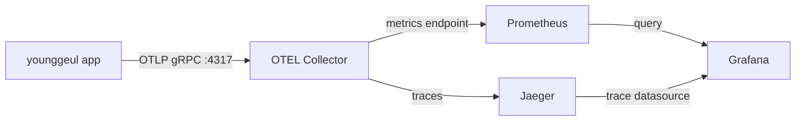

# Observability

## Overview

younggeul uses an observability pipeline built around OpenTelemetry and Prometheus-compatible metrics:

- **Application** emits traces and metrics via OTEL SDK instrumentation.
- **OTEL Collector** receives OTLP telemetry and routes it to backends.
- **Jaeger** stores and visualizes distributed traces.
- **Prometheus** scrapes/exports metrics from the collector endpoint.
- **Grafana** provides dashboards and alerting on top of Prometheus and Jaeger datasources.

## Start the observability stack

```bash
docker compose --profile obs up -d
```

## Service URLs

- Jaeger: http://localhost:16686
- Prometheus: http://localhost:9090
- Grafana: http://localhost:3000

## Environment variables (enable OTEL in app)

Set the following before running the app locally:

```bash
export OTEL_ENABLED=true
export OTEL_EXPORTER_OTLP_ENDPOINT=http://localhost:4317
export OTEL_EXPORTER_OTLP_INSECURE=true
```

## Metrics emitted by younggeul

All metrics are exported with the `younggeul_` namespace.

| Metric name | Type | Typical labels | Description |
|---|---|---|---|
| `younggeul_simulation_runs_total` | Counter | `app`, `status` | Total simulation runs by final status (e.g., success/error). |
| `younggeul_simulation_duration_seconds` | Histogram | `app`, `status` | End-to-end simulation duration distribution. |
| `younggeul_simulation_node_duration_seconds` | Histogram | `app`, `node`, `status` | Node-level execution duration distribution per workflow node. |
| `younggeul_llm_requests_total` | Counter | `app`, `provider`, `model`, `status` | Total number of LLM requests by status/provider/model. |
| `younggeul_llm_request_duration_seconds` | Histogram | `app`, `provider`, `model`, `status` | LLM request latency distribution in seconds. |
| `younggeul_llm_tokens_total` | Counter | `app`, `provider`, `model`, `token_type` | Token usage totals split by token type (input/output/total). |
| `younggeul_llm_cost_usd_total` | Counter | `app`, `provider`, `model` | Accumulated estimated LLM cost in USD. |
| `younggeul_citation_gate_failures_total` | Counter | `app`, `status` | Total citation gate validation failures. |

## Grafana dashboard

The **Simulation Overview** dashboard is provisioned from:

- `infra/grafana/provisioning/dashboards/simulation-overview.json`

It focuses on runtime health and LLM behavior with these panels:

1. Simulation Runs (stat, grouped by `status`)
2. Simulation Duration P95 (time series)
3. Node Duration by Node P95 (time series by `node`)
4. LLM Requests (stat, grouped by `status`)
5. LLM Request Duration P95 (time series)
6. LLM Tokens Rate (time series by `token_type`)
7. LLM Cost (stat)
8. Citation Gate Failures (stat)

Default dashboard settings:

- Refresh: `10s`
- Time range: last `1h`
- Datasource: Prometheus (`uid: prometheus`)

## Alert rules

Alert rules are provisioned from:

- `infra/grafana/provisioning/alerting/alerts.yaml`

Configured rules:

1. **HighSimulationFailureRate**
   - Expression: `rate(younggeul_simulation_runs_total{status="error"}[5m]) / rate(younggeul_simulation_runs_total[5m]) > 0.5`
   - For: `5m`
   - Meaning: more than 50% of recent simulations are failing.

2. **HighLLMLatency**
   - Expression: `histogram_quantile(0.95, rate(younggeul_llm_request_duration_seconds_bucket[5m])) > 30`
   - For: `5m`
   - Meaning: p95 LLM latency is above 30 seconds.

3. **CitationGateFailureSpike**
   - Expression: `rate(younggeul_citation_gate_failures_total[5m]) > 0.1`
   - For: `5m`
   - Meaning: citation gate failures are spiking.

## Architecture diagram


